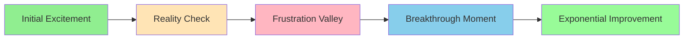

# AI Adoption Learning Curve

## Diagram Type: Productivity Curve Over Time with Psychological Phases
**Purpose**: Show the emotional and productivity journey of AI adoption, including the "frustration valley" and breakthrough moments

## Visual Elements

### Learning Curve Phases



### Productivity vs. Time Curve

```
Productivity
     ^
     |     ╭─────────────── Exponential Growth
     |    ╱
     |   ╱ Breakthrough
     |  ╱  
──────┼─╱─────────────────── Baseline (Manual Productivity)
     |╱    
     |    Frustration Valley
     |╲  ╱
     | ╲╱ 
     |  ╲ Initial Drop
     |   ╲
     |────╲──────────────────→ Time
     0    1w   2w   3w   4w   2m   3m+
```

### Detailed Phase Breakdown

#### Phase 1: Initial Excitement (Days 1-3)
- **Productivity**: 80-90% of baseline
- **Emotional State**: High optimism, curiosity
- **Characteristics**: "This is amazing!" moments
- **Common Experience**: Simple tasks work well

#### Phase 2: Reality Check (Days 4-10)
- **Productivity**: 60-70% of baseline  
- **Emotional State**: Growing concern
- **Characteristics**: AI doesn't understand complex requests
- **Common Experience**: "Maybe this won't work for my problems"

#### Phase 3: Frustration Valley (Days 11-21)
- **Productivity**: 40-60% of baseline
- **Emotional State**: Peak frustration, doubt
- **Characteristics**: Strong temptation to quit
- **Common Experience**: "I could do this faster myself"

#### Phase 4: Breakthrough Moment (Days 22-28)
- **Productivity**: Return to 90-100% baseline
- **Emotional State**: Relief, renewed confidence
- **Characteristics**: First major success with AI
- **Common Experience**: "Now I get it!"

#### Phase 5: Exponential Improvement (Month 2+)
- **Productivity**: 150-400% of baseline
- **Emotional State**: Growing mastery, excitement
- **Characteristics**: AI becomes natural extension
- **Common Experience**: "I can't imagine working without this"

### Comparison with Traditional Learning

| Aspect | Traditional Programming Learning | AI Tool Learning |
|--------|--------------------------------|------------------|
| **Fallback Option** | None (must persevere) | Always available (manual method) |
| **Feedback Loop** | Clear error messages | Ambiguous results |
| **Progress Indicators** | Code works or doesn't | Subjective quality assessment |
| **Emotional Challenge** | Intellectual frustration | Identity/competence threat |
| **Support Resources** | Extensive documentation | Limited, evolving guidance |

### Psychological Barriers Overlay

```
Emotional Intensity
     ^
     |  ╭─ Impostor Syndrome Peak
     |  │
     |  │  ╭─ "Am I Still a Real Developer?"
     |  │  │
     |  │  │   ╭─ Fear of Obsolescence  
─────┼──┴──┴───┴─────────────────────── Baseline Confidence
     |     ╲
     |      ╲─ "This is Too Hard"
     |       ╲
     |        ╲─ "Maybe I'm Too Old for This"
     |──────────────────────────────────→ Time
     0    1w    2w    3w    4w    2m
```

### Success Factors Analysis

#### High Success Predictors
- **Perseverance through frustration valley**
- **Systematic learning approach** 
- **Peer support/mentorship**
- **Protected learning time**
- **Clear ROI understanding**

#### Failure Predictors
- **Giving up during frustration phase**
- **Isolated learning attempts**
- **Perfectionist tendencies** 
- **Lack of structured methodology**
- **Immediate productivity pressure**

### Visual Design Notes

#### Primary Curve
- **Smooth curve** showing productivity over time
- **Color zones** for each emotional phase
- **Baseline reference line** at 100%
- **Key milestone markers**
- **Confidence bands** showing variation ranges

#### Annotations
- **Phase labels** with key characteristics
- **Common thoughts/feelings** at each stage
- **Breakthrough moment indicator**
- **Typical timeframes** (with variation ranges)

#### Interactive Elements
- **Hover details** for each phase
- **Toggle views**: Productivity vs. Emotional state
- **Personal tracking overlay** (where am I?)
- **Success story examples** at breakthrough points

### Implementation Considerations
- Chart should normalize different learning speeds
- Include "normal variation" ranges 
- Provide encouragement during valley phase
- Show multiple breakthrough patterns
- Connect to support resources at critical points
