# Expected ROI Timeline Visualization

## Diagram Type: Multi-phase Timeline Chart
**Purpose**: Replace text-based ROI timeline with visual representation showing productivity changes over time during AI adoption

## Visual Elements

### Timeline Structure
```
Weeks 1-2          Weeks 3-4          Month 2            Month 3+
[Red Zone]         [Yellow Zone]      [Light Green]      [Dark Green]
-50% Productivity  Baseline Return    +20-50% Gains      2-4x Gains
```

### Detailed Visualization

```mermaid
gantt
    title AI Adoption ROI Timeline
    dateFormat X
    axisFormat %d

    section Learning Phase
    Productivity Drop (50% decrease)    :crit, phase1, 0, 14
    
    section Recovery Phase  
    Return to Baseline                  :phase2, 14, 28
    
    section Growth Phase
    Initial Gains (20-50% increase)     :active, phase3, 28, 60
    
    section Mastery Phase
    Exponential Gains (2-4x)            :phase4, 60, 90
```



### Key Metrics Overlay
- **Week 1-2**: 50% productivity decrease (learning curve)
- **Week 3-4**: Return to baseline productivity  
- **Month 2**: 20-50% productivity increase in AI-appropriate tasks
- **Month 3+**: 2-4x productivity gains in optimal scenarios

### Visual Design Notes
- Use color coding: Red (decline), Yellow (recovery), Light Green (growth), Dark Green (mastery)
- Include confidence intervals/ranges for each phase
- Add milestone markers for key achievements
- Show cumulative ROI curve alongside weekly productivity
- Include "break-even" point indicator

### Chart Elements
1. **X-Axis**: Time (weeks/months)
2. **Y-Axis**: Productivity percentage (relative to manual baseline)
3. **Baseline Reference**: 100% manual productivity line
4. **Trend Lines**: Smooth curves showing progression
5. **Annotations**: Key milestones and learning moments

### Implementation Notes
- Chart should be embeddable in markdown
- Consider both static (PNG/SVG) and interactive versions
- Include hover tooltips with detailed explanations
- Responsive design for mobile viewing
