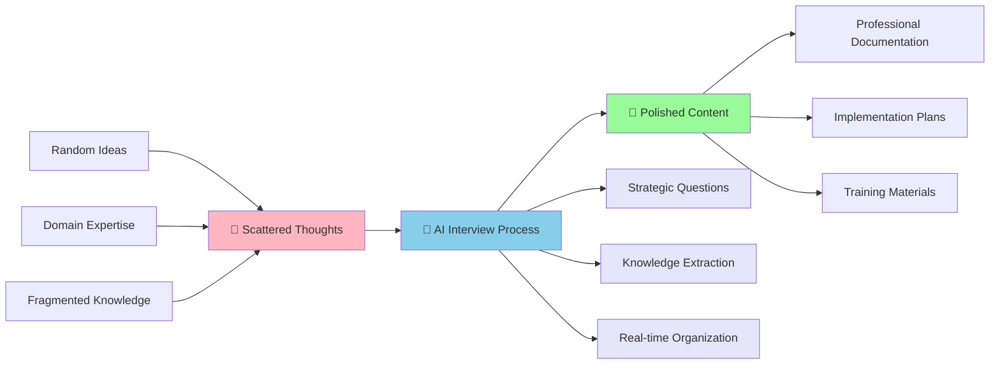

# Interview Method Core Concept

## Diagram Type: Process Transformation Flow
**Purpose**: Illustrate the fundamental transformation from scattered thoughts to polished content through AI-guided interviews

## Visual Elements

### Main Process Flow



### Traditional vs. Interview Method

```
Traditional Content Creation:
Human → [Organize] → [Structure] → [Write] → [Edit] → Final Content
  ↓         ↓           ↓          ↓        ↓
Struggle   Time      Writer's    Quality   Multiple
         Consuming   Block      Varies    Revisions

Interview Method:
Human → AI Interview → Final Content
  ↓           ↓            ↓
Share      Strategic     Consistent
Knowledge  Questions     Quality
```

### Barrier Removal Visualization

```
Traditional Barriers:
┌─────────────────┐    ┌─────────────────┐
│  Organization   │    │   Creative      │
│   Burden        │    │   Burden        │
│                 │    │                 │
│ • Structure     │    │ • What to write │
│ • Flow          │    │ • How to start  │
│ • Connections   │    │ • What to ask   │
└─────────────────┘    └─────────────────┘
         ↓                       ↓
    🚫 REMOVED 🚫         🚫 REMOVED 🚫
         ↓                       ↓
    ✅ AI Handles          ✅ AI Guides
```

## Key Advantages Highlighted
- **Zero preparation required**: No need to organize thoughts beforehand
- **AI-driven structure**: Professional organization without manual effort
- **Quality enhancement**: Output exceeds individual capabilities
- **Cognitive load reduction**: Focus on knowledge sharing, not presentation

## Placement Suggestion
Insert after the paragraph: "Instead, the AI handles the hard work of organization and content creation while you simply respond authentically to its questions."
