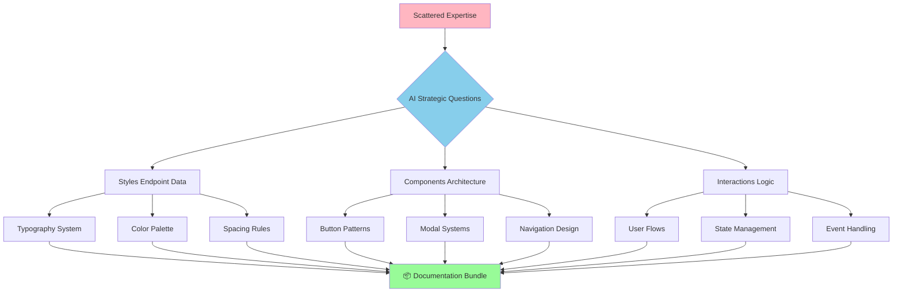

# Real-World Example: REST API Documentation Bundle

## Diagram Type: Before/After Transformation Visualization
**Purpose**: Demonstrate the dramatic transformation from scattered thoughts to comprehensive documentation

## Visual Elements

### Input vs. Output Comparison

```
SCATTERED INPUT (2 sentences):
┌─────────────────────────────────────────────────────────────────┐
│ "The three endpoints have information about styles, components   │
│ and interactions. I need to organize a plan to iteratively      │
│ implement the various components, create comprehensive styles    │
│ that would be used throughout the application and ensure proper  │
│ interactions amongst the components."                            │
└─────────────────────────────────────────────────────────────────┘
                                ↓
                     30-minute AI Interview
                                ↓
COMPREHENSIVE OUTPUT (Documentation Bundle):
┌─────────────────────────────────────────────────────────────────┐
│ 📋 Implementation Plans (7-8 documents):                        │
│    • Button Components                                          │
│    • Error Handling Systems                                     │
│    • Navigation Architecture                                    │
│    • Layout Management                                          │
│    • Modal Components                                           │
│    • Table Systems                                              │
│    • Form Controls                                              │
│                                                                 │
│ 🎨 Design System:                                               │
│    • Typography Scale                                           │
│    • Color System                                               │
│    • Spacing & Sizing                                           │
│    • Custom CSS Properties                                      │
│                                                                 │
│ 🏗️ Architecture Guidelines:                                     │
│    • Component Structure                                        │
│    • Data Flow Patterns                                         │
│    • Integration Strategies                                     │
│                                                                 │
│ 🔄 Interaction Patterns:                                        │
│    • User Flow Documentation                                    │
│    • State Management                                           │
│    • Component Communication                                    │
│                                                                 │
│ ✅ Validation Checklist:                                        │
│    • Implementation Standards                                   │
│    • Quality Assurance Steps                                    │
│    • Testing Requirements                                       │
└─────────────────────────────────────────────────────────────────┘
```

### Value Multiplication

```
Time Investment Analysis:

Manual Creation:
┌──────────────────┐
│ Individual Time  │ → 20-40 hours
│ • Research       │   (if possible at all)
│ • Organization   │
│ • Writing        │
│ • Structuring    │
│ • Formatting     │
└──────────────────┘

Interview Method:
┌──────────────────┐
│ Interview Time   │ → 30 minutes
│ • Conversation   │
│ • Authentic      │
│   responses      │
└──────────────────┘

Quality Comparison:
Manual: ⭐⭐⭐ (variable, often incomplete)
AI Interview: ⭐⭐⭐⭐⭐ (comprehensive, professional)
```

### Knowledge Extraction Process



## Key Insights Demonstrated

### Expansion Factor
- **Input**: 2 sentences of scattered thoughts
- **Output**: 8+ comprehensive documents
- **Expansion Ratio**: ~40:1 content multiplication

### Professional Quality
- Enterprise-level documentation standards
- Consistent formatting and structure
- Implementation-ready specifications
- Validation and quality assurance included

### Knowledge Discovery
AI questions revealed needs the developer hadn't considered:
- Design system requirements
- Architectural guidelines
- Interaction patterns
- Validation checklists

## Placement Suggestion
Insert immediately after the paragraph describing the REST API example results, before "This output far exceeded what the developer expected..."
