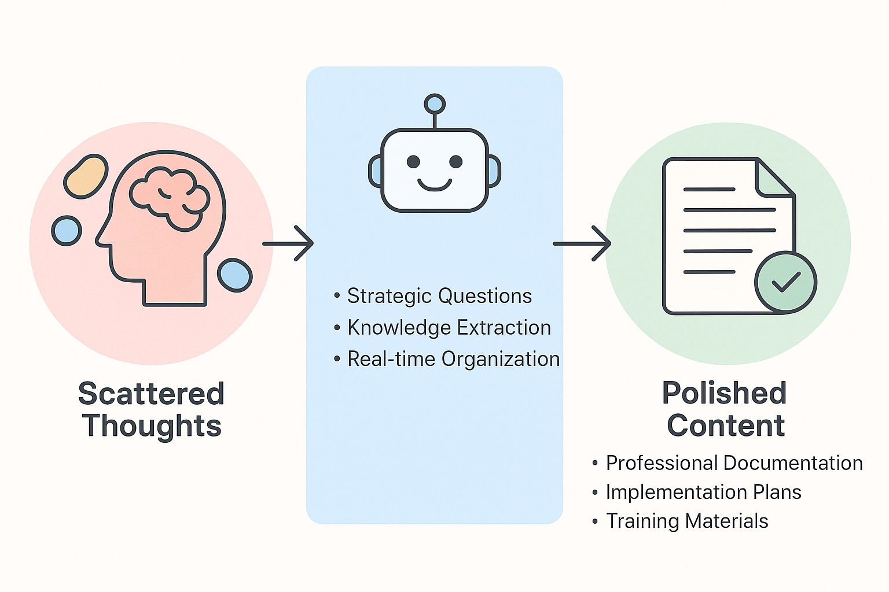
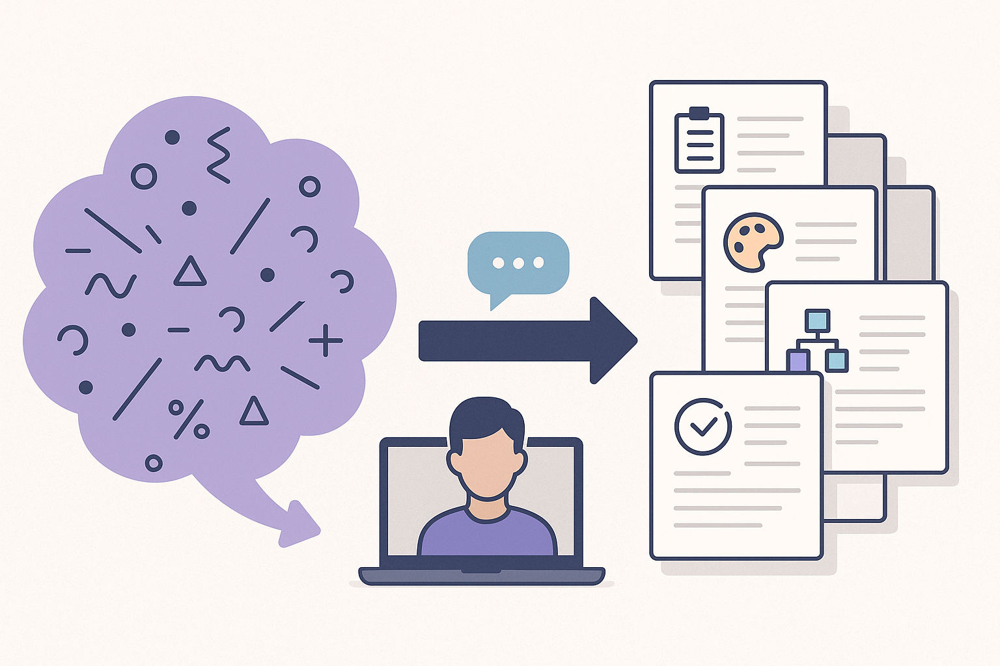

  

    <h1>The Interview Method: How AI Agents Can Extract and Organize Your Scattered Thoughts Into Polished Content</h1>
  

  

    
  

*A powerful approach to working with AI agents that transforms scattered knowledge into polished documentation through strategic questioning*

**⏱️ Reading Time**: 19 minutes

---

Welcome to the Interview Method—a powerful approach to working with AI agents that flips the traditional "tell the AI what to do" script on its head. Instead of trying to organize your thoughts yourself, you let the AI become your personal knowledge archaeologist, extracting and structuring your expertise through targeted questioning.

## What Is the Interview Method?

The Interview Method is exactly what it sounds like: having an AI agent interview you about a topic to gather your scattered thoughts, random ideas, and domain expertise, then transform that raw input into polished, professional content. It's particularly powerful when you have a lot of knowledge about something but lack the time or expertise to formalize it into documentation, proposals, implementation plans, or other structured content.

This approach works because it removes two major barriers that often prevent us from creating great content:
1. **The organization burden**: You don't need to figure out how to structure your thoughts
2. **The creative burden**: You don't need to come up with the right questions or know what information to include

Instead, the AI handles the hard work of organization and content creation while you simply respond authentically to its questions.

## Why This Method Works So Well

### Universal Applicability
This isn't just for software developers or technical writers. The Interview Method works across industries and use cases:
- **Business documentation**: Creating employee onboarding materials, process documentation, or training guides
- **Proposals and presentations**: Formalizing ideas for stakeholder buy-in or client pitches
- **Technical planning**: Generating implementation plans and architectural documentation
- **Knowledge capture**: Extracting expertise from subject matter experts
- **Content creation**: Blog posts, articles, and thought leadership pieces

Understanding the strategic business context for AI adoption helps frame the Interview Method as part of broader organizational transformation. **[The AI Coding Revolution: Your Team's Survival Guide](https://bhanford9.github.io/AI-Blog-Posts/ai-coding-revolution-team-survival-guide)** (15-minute read) provides essential context for positioning knowledge extraction and content creation capabilities as competitive advantages that justify investment in systematic AI collaboration approaches.

## Why the Interview Method Works

The Interview Method leverages a fundamental psychological insight: humans organize knowledge through conversation. By having the AI conduct a structured interview, you activate natural communication patterns that help surface connections, identify gaps, and structure information in ways that feel intuitive and comprehensive.

The Interview Method specializes **[Planning-First Methodology](https://bhanford9.github.io/AI-Blog-Posts/planning-first-ai-methodology-foundation)** principles for knowledge extraction and content creation, where AI develops comprehensive understanding before implementation.

### Quality That Exceeds Expectations
One of the most striking aspects of this method is how consistently it produces output that's better than what you could create on your own. The AI doesn't just organize your thoughts—it often expands on them, creates better structure, and includes considerations you might have missed.

### The Power of AI-Generated Questions
Perhaps the most valuable aspect is how the AI asks questions that spark thoughts you wouldn't have had otherwise. It knows how to probe for the right information and guide you toward ensuring the best content makes it into your final product.

## Foundation in Planning-First Methodology

The Interview Method specializes **[Planning-First Methodology](https://bhanford9.github.io/AI-Blog-Posts/planning-first-ai-methodology-foundation)** principles for knowledge extraction and content creation, where AI develops comprehensive understanding before implementation.

**For Software Developers**: The Interview Method excels at generating comprehensive implementation plans without requiring manual organization or structure. You provide technical knowledge through conversation; AI produces detailed, well-structured planning documents.

**Key Advantages for Technical Planning**:
- **No manual organization required**: AI handles all structuring and formatting
- **Comprehensive coverage**: Interview questions ensure no critical details are missed  
- **Professional documentation**: Output matches enterprise-quality planning standards
- **Implementation-ready**: Generated plans integrate seamlessly with development workflows

*For guidance on choosing between Interview Method, standard Planning-First, and Multi-Phase Planning approaches, see the decision framework in [Planning-First AI Methodology](planning-first-ai-methodology-foundation.md#choosing-your-planning-approach).*

## Two Approaches: Simple vs. Dual-AI

### Approach 1: The Simple Method

The straightforward approach works well when you have a clear sense of your topic and can easily explain what you want to create. Your initial prompt might look like this:

*"I have ideas about [topic]. I need you to interview me about this topic with the goal of creating [specific output type - blog post, documentation, implementation plan, etc.]."*

This approach typically works best when:
- You know the confined amount of information you want to cover
- You already have an idea of some questions that should be asked
- The topic isn't overly complex or multifaceted

### Approach 2: The Dual-AI Method

For more complex topics or when you're not sure what questions should be asked, the dual-AI approach is incredibly powerful. Here's how it works:

**Step 1**: Interact with the first AI to generate an expert interviewer prompt  
**Step 2**: Use that generated prompt with a fresh AI instance to conduct the actual interview

An example of the first prompt might be:

*"My company has a complex set of tools and processes that every new employee must learn and master to be successful at the company. I need to create documentation for these tools and processes so that new employees have clear steps and examples to follow during their day-to-day which will help them gain the expertise needed to be successful. Create a markdown file to provide to an AI agent that will instruct it to interview me about these tools and processes to gain the necessary information to generate the documentation and instructions to help new employees."*

The AI will create a comprehensive markdown file that you can then feed to a fresh AI instance with a simple prompt: *"Consume this markdown file to understand how I need you to interview me and then conduct the interview."*

This approach works best when:
- You don't have a good sense of what questions should be asked
- The topic is complex or multifaceted
- You want a more thorough, detailed interview process

*For managing complex, multi-faceted projects where the Interview Method generates substantial documentation bundles, see [Multi-Phase Planning](https://bhanford9.github.io/AI-Blog-Posts/multi-phase-planning-documentation-bundles).*

## A Real-World Example: From Scattered Thoughts to Documentation Bundle

Let me share a concrete example that demonstrates the power of this method. A software developer had scattered thoughts about consuming data from a REST API across three different endpoints. The data would define how a front-end application should be designed, including styles, components, and interactions between elements.

**Initial scattered thoughts**: "The three endpoints have information about styles, components and interactions. I need to organize a plan to iteratively implement the various components, create comprehensive styles that would be used throughout the application and ensure proper interactions amongst the components."

**The result**: After a 30-minute interview, the AI didn't just create a simple implementation plan—it generated what it called a "documentation bundle" consisting of:
- 7-8 specific implementation plans for different components (buttons, error-handling, navigation, layout, modals, tables, etc.)
- A comprehensive design system with custom CSS properties including typography, color system, spacing & sizing
- General architectural guidelines
- Interaction patterns documentation
- A validation checklist for implementation

This output far exceeded what the developer expected and would have taken many hours to create manually—if they could have created something this comprehensive at all.

## The Interview Process: What to Expect

### Length and Scope
Interview sessions typically range from 10 minutes for simple topics to over 30 minutes for complex subjects. The AI might ask anywhere from 6-10 questions for straightforward topics, up to 20+ questions for comprehensive coverage.

**Pro tip**: Don't be afraid to set boundaries. You can tell the AI upfront to limit the number of questions, or simply end the interview when you feel you've covered enough ground.

### Your Response Style
The beauty of this method is that you don't need to prepare anything beforehand. You can:
- Respond to multiple questions in a single message
- Include analogies and examples wherever they come to mind
- Reword questions as you start your response to keep things organized
- Skip questions that aren't relevant or that you can't answer

Your responses don't need to be perfectly organized—that's the AI's job. A typical response might be just a paragraph per question, and the AI excels at untangling and organizing even seemingly jumbled thoughts.

### Raw Input vs. Polished Output
Here's what makes this method so powerful: your "raw, unorganized input" gets transformed into pristine, professional content. When you tell stories or give analogies, the AI preserves your intent and actual words while making minor improvements for clarity and flow.

The final output consistently features:
- Better organization than you could achieve alone
- More comprehensive content than originally envisioned
- Professional structure and formatting
- Minimal need for editing (usually just removing timestamps, contact info, or generic suggestions)

## Benefits That Go Beyond Time Savings

### Cognitive Load Reduction
The Interview Method eliminates the need to spend mental energy on creativity and organization. You simply respond authentically to questions while the AI handles all the structural and creative heavy lifting.

### Knowledge Discovery
The AI's questions often spark thoughts and considerations you wouldn't have come up with on your own. It's like having a skilled interviewer who knows exactly what information is needed for your specific goal.

### Consistent Quality
Unlike traditional content creation where quality can vary based on your mood, energy level, or available time, this method consistently produces high-quality, well-organized output.

### Vocabulary Enhancement
An unexpected benefit is learning new terminology and phrases from the AI that improve your future interactions. Terms like "documentation bundle" often emerge from these sessions and become part of your working vocabulary with AI agents.

## When This Method Works Best (And When It Doesn't)

### Ideal Scenarios
- You have expertise but struggle with organization
- You're short on time but need professional-quality output
- You're not sure what information should be included
- You want to explore a topic more thoroughly than you initially planned

### Less Ideal Scenarios
- You already have clear, organized thoughts and a straightforward path forward
- You're uncomfortable with markdown output and lack tools to convert it
- You need very specific formatting that requires precise control

### Managing Limitations
The main limitation is that most AI agents default to markdown output. While this is great if you have tools to convert markdown to PDFs or other formats, it might be limiting if you need output in specific formats like PowerPoint, Excel, or custom document templates.

## Best Practices for Success

### 1. Be Clear About Subject and Intent
Your initial prompt should clearly communicate both what you want to discuss and what you want to create. The AI needs to understand both the topic and the end goal.

### 2. Don't Overthink Your Responses
Authenticity beats perfection. The AI excels at organizing and improving your raw thoughts, so focus on sharing information rather than crafting perfect responses.

### 3. Choose the Right Approach
Use the simple method when you understand your topic well and the dual-AI method when you need help determining what questions should be asked.

### 4. Manage Interview Scope
Set expectations upfront about interview length or be prepared to end the interview when you feel you've covered sufficient ground.

### 5. Embrace the Process
This method works best when you trust the process and let the AI guide the conversation. The tangential path often leads to better results than a direct approach.

## Getting Started: Your First Interview

If you're new to this method, start with something manageable but meaningful. Consider:
- Documenting a process you know well at work
- Creating a guide for a hobby or skill you have
- Organizing thoughts for a presentation or proposal you need to give
- Developing training materials for something you could teach others

Begin with the simple approach: describe your topic in 2-4 sentences and ask the AI to interview you with the goal of creating your desired output.

## The Future of the Interview Method

As AI capabilities continue to evolve, this method has tremendous room for growth. Currently, most outputs default to markdown, but future iterations could generate PowerPoint presentations, Excel reports, websites, PDFs, or any format common to specific industries.

The method also represents a shift in how we think about working with AI agents. Instead of trying to be the perfect prompt engineer, we can focus on being authentic subject matter experts while the AI handles the complexity of organization and presentation.

## Why This Changes Everything

The Interview Method fundamentally changes the relationship between human expertise and AI capabilities. It recognizes that humans are often knowledge-rich but time-poor when it comes to documentation and content creation. By letting AI agents extract and organize our expertise through skilled questioning, we can create professional-quality content that would otherwise require significant time investment or specialized writing skills.

This isn't just about efficiency—it's about unlocking knowledge that might otherwise remain trapped in people's heads because the barrier to formalizing it seemed too high.

Whether you're a software developer needing implementation documentation, a business leader creating training materials, or anyone with expertise that needs to be shared, the Interview Method offers a powerful way to transform your scattered thoughts into polished, professional content.

The next time you find yourself with a head full of ideas but no clear path to organizing them, remember: you don't have to be the expert at everything. Let the AI be the expert interviewer and content organizer while you focus on what you do best—sharing your knowledge and insights.

---

### **Related Posts**

**Essential Reading:**
- [Planning-First AI Methodology Foundation](https://bhanford9.github.io/AI-Blog-Posts/planning-first-ai-methodology-foundation) - *Complement interview method with structured planning*
- [Multi-Phase Planning Documentation Bundles](https://bhanford9.github.io/AI-Blog-Posts/multi-phase-planning-documentation-bundles) - *Scale interview insights into comprehensive documentation*
- [AI Code Quality Detective: Hunting Technical Debt](https://bhanford9.github.io/AI-Blog-Posts/ai-code-quality-detective-technical-debt) - *Use interview techniques for technical discovery*

**Dive Deeper:**
- [The AI Coding Revolution: Team Survival Guide](https://bhanford9.github.io/AI-Blog-Posts/ai-coding-revolution-team-survival-guide) - *Strategic context for knowledge extraction methods*
- [Measuring AI Impact Beyond Gut Feeling](https://bhanford9.github.io/AI-Blog-Posts/measuring-ai-impact-beyond-gut-feeling) - *Quantify the value of organized documentation*

---

*Ready to try it? Start with something simple: pick a topic you know well, tell an AI agent you want to be interviewed about it, specify what kind of document you want to create, and see where the conversation takes you. You might be surprised by what emerges from that scattered collection of thoughts in your head.*

