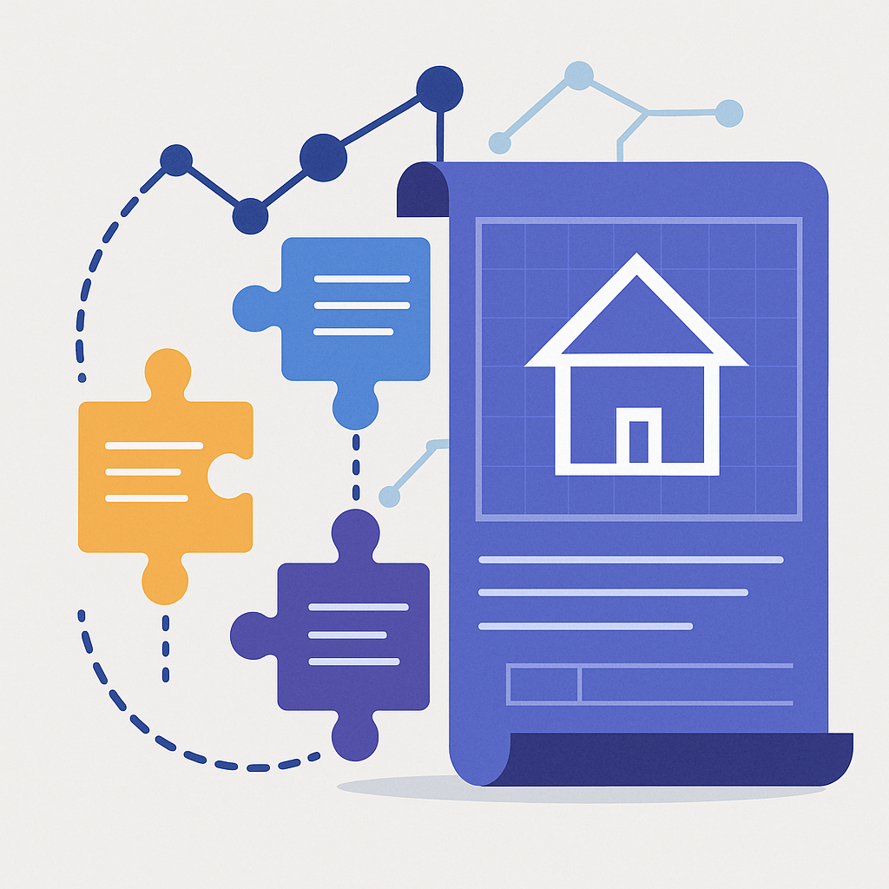
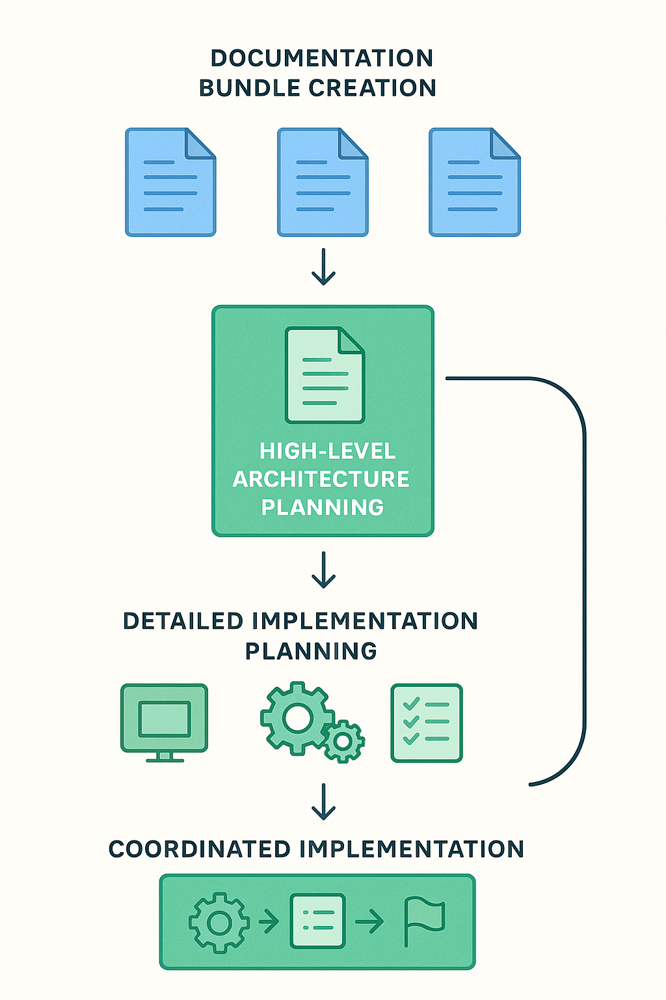
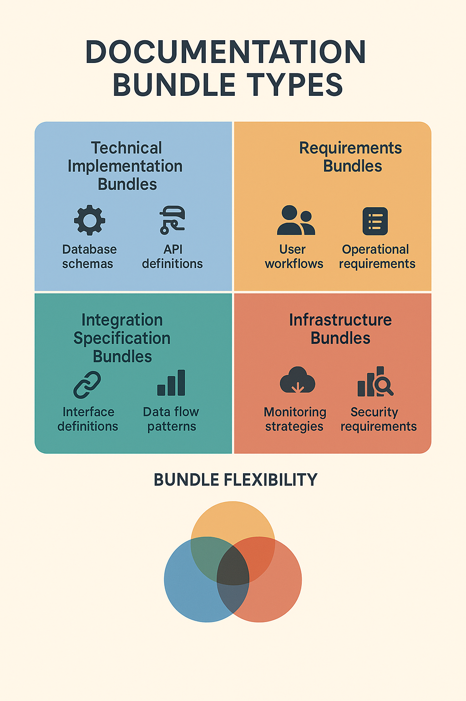
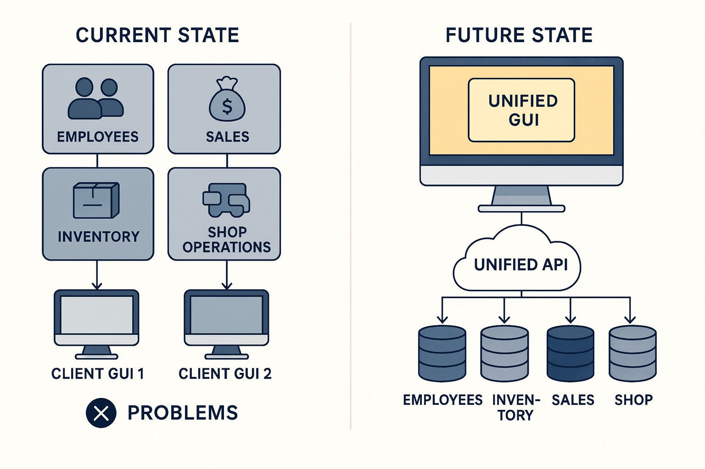

  

    <h1>Multi-Phase Planning: Managing Complex AI Projects with Documentation Bundles</h1>
  

  

    
  

*When simple planning isn't enough: A systematic approach to tackling enterprise-scale integration projects using AI collaboration*

**⏱️ Reading Time**: 11 minutes

---

Standard **[Planning-First Methodology](https://bhanford9.github.io/AI-Blog-Posts/planning-first-ai-methodology-foundation)** works excellently for most development tasks, but some projects are simply too large and complex for a single planning session. When you're dealing with multiple services, complex dependencies, varying data structures, and extensive domain knowledge, you need a more sophisticated approach: Multi-Phase Planning.

Multi-Phase Planning extends the Planning-First foundation by breaking complex projects into manageable documentation phases, creating what AI agents often call "Documentation Bundles"—comprehensive collections of related plans that work together to solve enterprise-scale challenges.

*For guidance on choosing between standard Planning-First, Multi-Phase Planning, and Interview Method approaches, see the decision framework in [Planning-First AI Methodology](planning-first-ai-methodology-foundation.md#choosing-your-planning-approach).*

## When Standard Planning Isn't Enough

Multi-Phase Planning becomes necessary when your project involves:

- **Multiple large projects or services** with varying dependencies
- **Complex data structures** that span across different systems
- **Extensive domain knowledge** that can't be captured in a single prompt
- **Integration challenges** between previously independent systems
- **Enterprise-scale coordination** requiring architectural oversight

The warning signs that you need Multi-Phase Planning include:
- Your initial planning prompt becomes unwieldy (500+ words of context)
- The AI asks for clarification on fundamental architectural decisions
- You're working across more than 3-4 major system components
- Dependencies between components are unclear or complex
- Standard planning produces surface-level results that miss critical integration points

## The Multi-Phase Planning Process

### Phase 1: Documentation Bundle Creation
Begin by creating focused documentation for each major component or service involved in your overall task. 

**Documentation Bundles are flexible collections that adapt to your project's specific needs.** The term "bundle" refers to any comprehensive collection of related plans, whether they're technical specifications, business requirements, architectural overviews, or implementation strategies. The key is creating focused, complete documentation for each major component or domain in your project.

**Common Bundle Types:**
- **Technical Implementation Bundles**: Database schemas, API definitions, architectural overviews
- **Business Requirement Bundles**: User workflows, business logic, operational requirements  
- **Integration Specification Bundles**: Interface definitions, data flow patterns, coordination requirements
- **Infrastructure Bundles**: Deployment architecture, monitoring strategies, security requirements

Each documentation bundle should include the elements most relevant to the task and your project and may have documents sourced from different bundle types.

**Key Strategy**: Use fresh AI context for each documentation bundle. This prevents context pollution and ensures focused attention on each component. Tell the AI to ask clarifying questions for anything it's not confident about—each bundle should take 15 minutes or less and doesn't need to be fully comprehensive.

For systematic knowledge extraction from team members who understand complex legacy systems, consider integrating **[The Interview Method](https://bhanford9.github.io/AI-Blog-Posts/ai-interview-method-scattered-thoughts)** (10-minute read) during documentation bundle creation. This structured approach helps capture critical domain knowledge, business logic, and architectural decisions that might not be obvious from code examination alone, ensuring your documentation bundles include both technical and contextual understanding.

### Phase 2: High-Level Architecture Planning
With documentation bundles complete, create a new AI context for architectural planning. Provide:

- **Current state description**: How systems currently operate independently
- **End goal definition**: Desired integrated solution outcome
- **Component inventory**: List of all projects/services with their documentation bundles
- **Integration requirements**: Specific business needs driving the project

Instruct the AI to review all documentation bundles and create a high-level architecture plan that satisfies the end goal. This plan serves as the master blueprint for the entire integration project.

### Phase 3: Detailed Implementation Planning
Within the same context as your architectural planning, have the AI create:

- **Individual migration plans**: Detailed implementation strategies for each existing service
- **Integration implementation plan**: Specific steps for connecting services with new interfaces
- **Progress tracking checklist**: Organized task list for monitoring project advancement
- **Final coordination checklist**: Master checklist tracking all phases of the migration and architecture

### Phase 4: Coordinated Implementation
With all planning complete, instruct the AI to "implement the plan, tracking progress within the checklist along the way." The AI will work through phases iteratively, checking in before moving to the next phase while maintaining awareness of the overall project scope.

## Real-World Example: Car Dealership Integration

Consider a software team developing solutions for a car dealership with multiple independent business areas:

**Current State**:
- **Employees, Inventory, Sales**: Complete independent software systems
- **Shop Operations**: Separate system handling scheduling, services/repairs, automation/robotics
- **Two distinct Client GUIs**: Requiring employees to work across different applications

**Business Goal**: Integrate all systems into a single solution with restructured backends, improved APIs, and unified GUI.

### Documentation Bundle Phase
Create focused documentation for each major component:

1. **Employee Management System Bundle**
   - Database schema for employee data, roles, permissions
   - API definitions for authentication, profile management
   - Current architectural overview and integration points
   - Business purpose and requirements documentation

2. **Inventory Management System Bundle**
   - Product database schema, supplier relationships, stock tracking
   - Inventory API definitions and data flow patterns
   - Current system architecture and external dependencies
   - Business logic and operational requirements

3. **Sales System Bundle**
   - Customer database, transaction history, sales pipeline schema
   - Sales API definitions, reporting interfaces
   - Current sales process architecture
   - Sales team workflow and business requirements

4. **Shop Operations Bundle**
   - Service scheduling database, repair tracking, robotics integration
   - Shop API definitions, automation interfaces
   - Complex operational architecture overview
   - Shop workflow and technical requirements

Each bundle creation uses fresh AI context with clarifying questions enabled, taking approximately 15 minutes per system component.

### High-Level Architecture Planning
Using new AI context, provide:
- Description of current independent systems vs. integrated goal
- List of all four documented components with their bundles
- Business integration requirements and constraints
- Performance and scalability expectations

The AI reviews all documentation bundles and creates a master architecture plan addressing:
- Unified data layer strategy
- API standardization and integration patterns  
- New GUI architecture and user experience flow
- Migration sequence and risk mitigation
- System integration testing and validation approaches

### Detailed Implementation Planning
Within the same architectural context, the AI generates:

**Individual System Migration Plans**:
- Employee system modernization steps
- Inventory system API enhancement plan
- Sales system integration preparation
- Shop operations system coordination plan

**Integration Implementation Plan**:
- Unified API gateway implementation
- Data synchronization and consistency strategies
- New GUI development and integration steps
- Testing and validation protocols

**Project Coordination Tools**:
- Phase-by-phase progress tracking checklist
- Risk monitoring and mitigation tracking
- Final master checklist for complete project oversight

### Coordinated Implementation
The AI implements the comprehensive plan while maintaining checklist progress, coordinating between individual system changes and overall integration requirements.

## Advanced Multi-Phase Techniques

### Context Management Strategies

**Fresh Context for Documentation**: Each documentation bundle uses clean AI context to prevent information bleed between components.

**Persistent Context for Architecture**: High-level planning, detailed planning, and implementation use the same context to maintain architectural consistency.

**Context Debugging**: If the AI loses track of the overall plan, reference the master checklist and architectural overview to re-establish focus.

### Documentation Bundle Variations

Multi-Phase Planning isn't limited to the four-document approach. Complex projects might require:

**Technical Focus Bundles**:
- Security architecture and compliance requirements
- Performance benchmarks and scalability targets
- Integration testing strategies and acceptance criteria

**Business Focus Bundles**:
- User experience requirements and workflow analysis
- Change management and training requirements
- Business continuity and rollback procedures

**Infrastructure Focus Bundles**:
- Deployment architecture and environment requirements
- Monitoring and observability strategies
- Disaster recovery and backup procedures

### Quality Assurance for Multi-Phase Projects

**Documentation Bundle Review**: Each bundle should be reviewed for completeness before proceeding to architectural planning.

**Architectural Plan Validation**: High-level architecture should be validated against business requirements before detailed planning begins.

**Implementation Plan Coherence**: Detailed plans should be checked for consistency with architectural decisions and realistic timelines.

**Progress Tracking Discipline**: Regular checklist review ensures project stays on track and identifies coordination issues early.

## Managing Complexity and Avoiding Pitfalls

### Common Multi-Phase Planning Mistakes

**Rushing Documentation Bundles**: Inadequate component documentation leads to poor architectural decisions. Take time to ensure each bundle captures essential system characteristics.

**Context Pollution**: Mixing documentation creation with architectural planning dilutes focus and reduces plan quality.

**Over-Engineering**: Creating more documentation than necessary for the complexity level of your project.

**Under-Coordination**: Failing to maintain connection between detailed plans and overall architectural vision.

### Success Indicators

**Quality Documentation Bundles**: Each bundle provides clear understanding of component purpose, data structures, and integration points.

**Coherent Architecture Plan**: High-level plan addresses all integration challenges while maintaining realistic scope.

**Actionable Implementation Plans**: Detailed plans provide specific steps that can be executed independently while contributing to overall goals.

**Effective Progress Tracking**: Checklists provide meaningful milestones and enable early identification of coordination issues.

### Time Investment and ROI

**Documentation Phase**: 15 minutes per component × number of components
**Architectural Planning**: 30-60 minutes depending on integration complexity  
**Detailed Planning**: 45-90 minutes for comprehensive implementation planning
**Total Planning Time**: Typically 2-4 hours for enterprise-scale projects

**ROI Considerations**: Multi-Phase Planning prevents months of architectural rework and integration challenges that commonly arise in complex projects. The planning investment typically represents less than 5% of total project time while dramatically reducing implementation risks.

## Integration with Other AI Methodologies

### Relationship to Planning-First Methodology

Multi-Phase Planning extends **[Planning-First](https://bhanford9.github.io/AI-Blog-Posts/planning-first-ai-methodology-foundation)** principles for projects that exceed single-context planning capabilities. The core benefits remain: quality context building, resource optimization, and reduced debugging cycles.

### Connection to Advanced AI Strategies

Multi-Phase Planning often serves as the foundation for other advanced techniques:
- **Complex codebase strategies** benefit from the architectural oversight
- **Measurement approaches** can track progress across multiple coordinated phases
- **Interview Methods** might be used within individual documentation bundle creation

### Workflow Integration

Multi-Phase Planning works particularly well in environments using:
- **Agile development methodologies** where architectural planning enables better sprint organization
- **DevOps practices** where infrastructure and deployment considerations are documented early
- **Enterprise governance processes** where architectural decisions require approval and documentation

## Scaling Multi-Phase Planning

### For Larger Projects

Projects involving more than 6-8 major components might require:
- **Hierarchical documentation bundles** with sub-component documentation
- **Multi-tier architectural planning** with domain-specific architecture plans
- **Specialized coordination planning** for cross-domain integration challenges

### For Smaller Complex Projects

Not every complex project requires full Multi-Phase Planning. Consider lighter approaches:
- **Two-phase planning**: Documentation bundles followed by single comprehensive implementation plan
- **Focused documentation**: Create bundles only for the most complex or poorly understood components
- **Architectural planning only**: Skip detailed implementation planning if standard Planning-First can handle individual components

## Conclusion: Orchestrating Complex Change

Multi-Phase Planning transforms overwhelming enterprise-scale projects into manageable, coordinated efforts. By systematically building understanding through documentation bundles, creating coherent architectural vision, and maintaining coordination through detailed planning, you enable AI collaboration on projects that would otherwise be impossible to tackle effectively.

The key insight is that complexity doesn't eliminate the benefits of planning—it requires more sophisticated planning approaches. Multi-Phase Planning provides the structure needed to maintain AI effectiveness while scaling to enterprise-level challenges.

As your projects grow in scope and complexity, remember that the Documentation Bundle approach can be adapted to your specific needs. The core principle remains constant: build comprehensive understanding before implementation, maintain architectural coherence throughout the process, and track coordination carefully to ensure successful integration.

Whether you're integrating multiple business systems, modernizing complex legacy architectures, or coordinating large-scale platform migrations, Multi-Phase Planning provides the framework for transforming complex challenges into achievable, coordinated progress.

---

### **Related Posts**

**Essential Reading:**
- [Planning-First AI Methodology Foundation](https://bhanford9.github.io/AI-Blog-Posts/planning-first-ai-methodology-foundation) - *Master the foundation before scaling to multi-phase*
- [AI Interview Method for Scattered Thoughts](https://bhanford9.github.io/AI-Blog-Posts/ai-interview-method-scattered-thoughts) - *Extract complex domain knowledge for documentation bundles*
- [Taming the Monolith: AI Legacy Code Strategies](https://bhanford9.github.io/AI-Blog-Posts/taming-monolith-ai-legacy-strategies) - *Apply multi-phase approaches to legacy system challenges*

**Dive Deeper:**
- [AI Code Quality Detective: Hunting Technical Debt](https://bhanford9.github.io/AI-Blog-Posts/ai-code-quality-detective-technical-debt) - *Quality assessment across complex project phases*
- [Overcoming AI Resistance from Smart Developers](https://bhanford9.github.io/AI-Blog-Posts/overcoming-ai-resistance-smart-developers) - *Build team consensus for complex AI methodologies*

---

*Ready to tackle your next complex integration project? Start by identifying your major system components and creating focused documentation bundles—you'll be surprised how much clarity emerges from systematic decomposition of complex challenges.*

