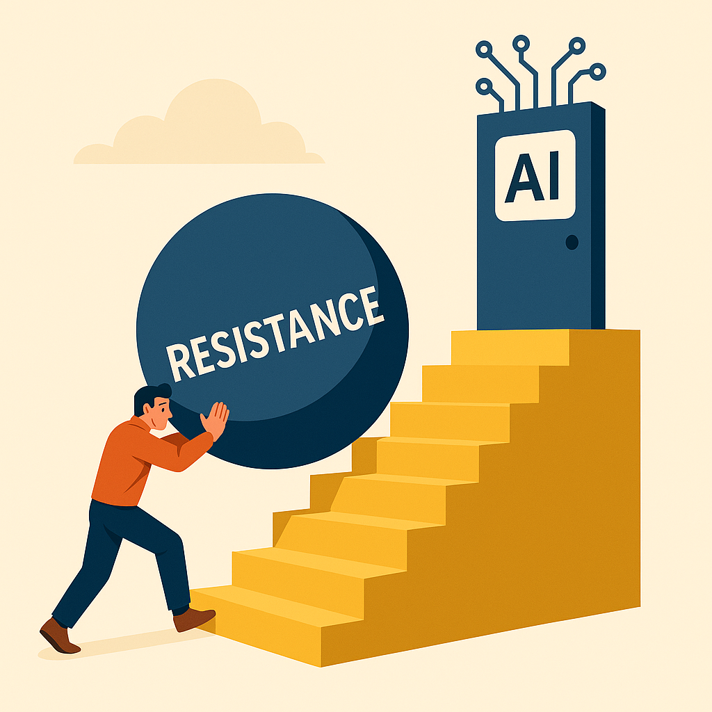
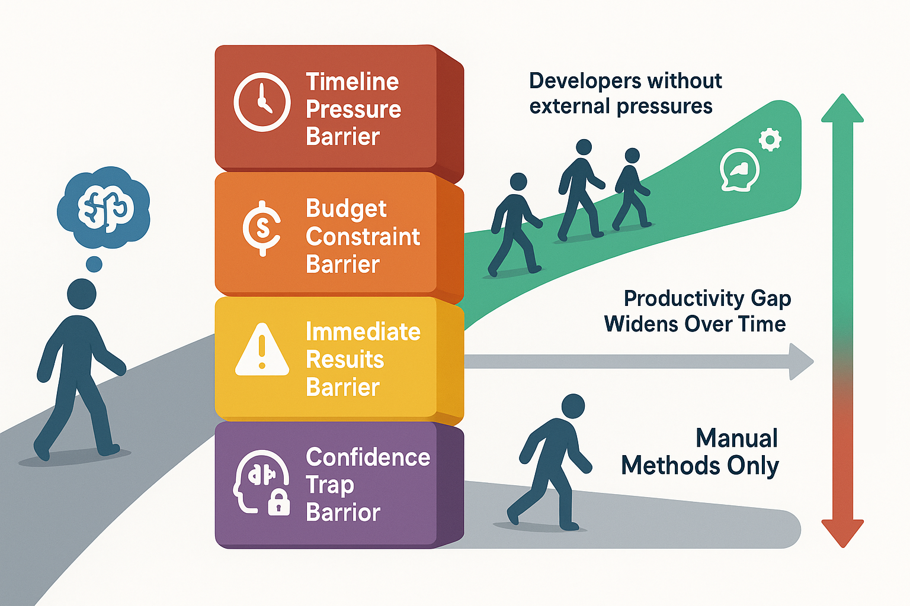

  

    <h1>Why Smart Developers Resist AI Coding Tools</h1>
  

  

    
  

*Understanding the psychology of AI adoption resistance and building successful change management strategies for development teams*

**⏱️ Reading Time**: 12 minutes

---

The most capable developers on your team might also be the most resistant to AI coding tools. This isn't a contradiction—it's a predictable pattern rooted in psychology, not technology. Understanding why intelligent, experienced developers resist AI adoption is the first step toward building successful change management strategies that transform skeptical teams into AI-powered productivity engines.

The challenge isn't convincing developers that AI tools work. Most developers acknowledge the potential. The real challenge is overcoming the psychological barriers that make the learning investment feel risky, uncomfortable, or unnecessary when there's always the option to fall back to familiar manual methods.

## The Fallback Problem: Why Having Options Hurts Adoption

### The Core Psychological Hurdle

The biggest obstacle to AI adoption isn't technical limitations or tool quality—it's the existence of a reliable fallback option. Unlike learning a new programming language where you have no choice but to persist through the learning curve, AI tools always leave developers with the option to abandon the AI and complete tasks manually.

This creates a unique psychological dynamic that undermines learning persistence. When AI collaboration doesn't work immediately, multiple pressures converge to make the fallback option irresistible:

**Timeline Pressure**: Project deadlines create urgency that makes the learning investment feel irresponsible.

**Monetary Restrictions**: Budget constraints make the "inefficient" learning period feel wasteful.

**Progress Desire**: The natural human drive to move forward conflicts with the temporary slowdown required for skill development.

**Competence Confidence**: Knowing you can solve the problem manually makes AI collaboration feel optional rather than necessary.

These pressures combine to create a powerful psychological force that pulls developers away from AI learning at exactly the moment when persistence would lead to breakthrough understanding.

### The Deepening Rut Effect

The fallback habit becomes increasingly problematic over time. Each time a developer abandons AI collaboration for manual implementation, they reinforce the neural pathway that says "AI isn't worth it." Meanwhile, other developers and teams are climbing to new heights of productivity and capability through persistent AI collaboration.

This creates a compounding disadvantage. The longer a developer remains in the manual implementation rut, the wider the gap becomes between their capabilities and those of AI-proficient colleagues. What starts as a temporary learning investment issue evolves into a significant competitive disadvantage.

### Breaking the Fallback Cycle

Successful AI adoption requires creating conditions where the fallback option becomes less attractive than persistence:

**Time Protection**: Explicitly allocate time for AI learning that isn't subject to immediate productivity pressure.

**Psychological Safety**: Create environments where learning slowdowns are expected and supported rather than penalized.

**Peer Support**: Use team-based learning approaches where individuals aren't struggling alone with AI collaboration challenges.

**Visible Progress**: Establish metrics and feedback systems that highlight learning progress even when immediate productivity suffers.

## Understanding Developer Resistance Patterns

### Beyond Seniority: Individual Variation

Contrary to common assumptions, resistance to AI tools doesn't correlate strongly with developer seniority. Both junior and senior developers show resistance for different reasons:

**Senior Developer Concerns**:
- Established workflows that feel efficient and proven
- Deep domain knowledge that seems irreplaceable by AI
- Concern about maintaining code quality and architectural integrity
- Investment in existing expertise that AI might seem to devalue

**Junior Developer Concerns**:
- Worry that AI dependency will prevent fundamental skill development
- Uncertainty about when AI assistance is appropriate versus learning impediment
- Lack of experience to evaluate AI-generated solutions effectively
- Fear that AI reliance will be professionally limiting

The key insight is that resistance is highly individual, based on personal experiences, learning styles, and professional priorities rather than predictable demographic patterns.

### Misaligned Expectations About AI Purpose

A significant source of resistance stems from fundamental misunderstandings about AI tools' intended role:

**"Real Programmers Don't Need AI"**: This perspective misframes AI as a crutch for incompetent developers rather than a productivity multiplier for capable ones.

**"I Should Be Able to Do This Myself"**: While developers can indeed complete tasks manually, this misses the point that AI enables doing work better, faster, and more efficiently.

**"AI Replaces Developer Skills"**: The fear that AI diminishes professional value ignores that AI collaboration itself is a valuable skill that enhances rather than replaces core programming abilities.

The correct framing positions AI as a tool that propels capable developers to new levels of productivity and capability, similar to how IDEs, frameworks, and libraries enhanced development without diminishing programmer value.

## Common Resistance Expressions and Their Underlying Issues

### Professional Resistance Statements

**"I told it to do something simple and it did the thing, but in the wrong place, so I ditched using it."** and **"I can get it to do simple things, but asking it to work on our large codebase just doesn't work."**

*Underlying Issue*: Expecting AI to work perfectly without learning proper context management and collaboration techniques.

*Available Solution*: **[Taming the Monolith: AI Coding in Complex Legacy Codebases](https://bhanford9.github.io/AI-Blog-Posts/taming-monolith-ai-legacy-strategies)** (20-minute read) provides comprehensive strategies for overcoming context limitations and complexity challenges in established systems.

**"It only understands coding things and can't apply the domain concepts in the way I need it to."**

*Underlying Issue*: Expecting AI to automatically understand business domain without explicit guidance.

*Available Solution*: **[The Interview Method](https://bhanford9.github.io/AI-Blog-Posts/ai-interview-method-scattered-thoughts)** (10-minute read) provides systematic techniques for extracting and structuring domain knowledge that AI can effectively understand and apply.

### Unprofessional Resistance Statements

**"It's just stupid"** and **"Our project is too complex for AI"**

*Underlying Issue*: Frustration from failed attempts being channeled into tool criticism rather than skill development, often using complexity as justification to avoid learning investment.

*Real Problem*: Lack of persistence through the learning curve and missing knowledge about effective AI collaboration techniques for complex scenarios.

### The Validation Behind Resistance

These statements often reflect real experiences with AI limitations. The key insight is that these limitations are typically overcome through better collaboration techniques rather than waiting for better AI tools. Most developers expressing these concerns haven't yet invested the time needed to develop effective AI collaboration skills for their specific challenges.

## Building Successful Change Management Strategies

### Creating Psychological Safety for Learning

The foundation of successful AI adoption is creating an environment where learning slowdowns are not just tolerated but actively supported:

**Explicit Time Allocation**: Set aside dedicated time for AI learning that isn't subject to immediate productivity pressure. This might be 30-45 minutes daily or dedicated learning sprints.

**Learning Expectations**: Establish clear expectations that AI adoption will temporarily slow down productivity while building long-term capabilities.

**Failure Normalization**: Communicate that AI collaboration failures are expected parts of the learning process rather than indicators of tool inadequacy or personal incompetence.

**Progress Recognition**: Acknowledge and celebrate learning progress even when immediate productivity metrics don't improve.

### Leadership Requirements for Success

AI adoption initiatives fail without leadership that genuinely believes in the long-term value and is willing to invest in the learning process:

**Positive Leadership Mindset**: Teams need at least one leader who maintains optimism about AI potential and persistence through learning challenges.

**Resource Protection**: Leadership must protect learning time and resist pressure to abandon AI initiatives when immediate productivity suffers.

**Modeling Behavior**: Leaders should participate in AI learning themselves, demonstrating that the investment is valuable for everyone.

**Long-term Perspective**: Management must focus on long-term ROI rather than short-term productivity metrics during adoption phases.

Without this leadership foundation, teams will inevitably default to familiar manual methods when AI collaboration becomes challenging.

## Practical Adoption Framework

### Phase 1: Team-Based Learning Foundation

**Mobbing Session Implementation**: Start with daily 45-minute team mobbing sessions focused entirely on AI-driven development. This approach provides several critical benefits:

- **Shared Learning**: Everyone learns together rather than individuals struggling separately
- **Problem-Solving Collaboration**: Team members can collectively work through AI challenges
- **Knowledge Sharing**: Discoveries and techniques spread immediately across the team
- **Reduced Individual Pressure**: No single person bears the burden of AI proficiency development

**Simple Task Selection**: Begin with relatively straightforward tasks that provide AI collaboration learning opportunities without overwhelming complexity. **[Planning-First AI Methodology](https://bhanford9.github.io/AI-Blog-Posts/planning-first-ai-methodology-foundation)** (19-minute read) provides frameworks for structuring these initial learning tasks systematically.

**Collective Problem-Solving**: Encourage teams to work through AI limitations together, developing shared strategies for common challenges.

**Learning Documentation**: Capture and share insights about what works and what doesn't, building institutional knowledge about effective AI collaboration.

### Phase 2: Individual Integration

**Gradual Transition**: After 1-2 weeks of team mobbing, developers typically begin applying learned techniques to individual work items.

**Continued Support**: Maintain regular check-ins and knowledge sharing sessions to support individual AI integration efforts.

**Problem Escalation**: Provide clear paths for developers to get help when AI collaboration challenges arise in individual work.

**Success Sharing**: Create mechanisms for developers to share individual AI success stories with the team.

### Phase 3: Systematic Measurement

**Qualitative Indicators**: Initially, focus on qualitative improvements in AI collaboration effectiveness:
- AI appears to work better than before
- Developers report building intuition about effective AI collaboration
- Team members naturally integrate AI into regular workflow

**Quantitative Tracking**: Once basic proficiency is established, begin systematic data collection for each work item:
- **Complexity Rating**: Low, medium, or high complexity assessment
- **Completion Time**: Time required to complete the work item
- **AI Usage Rating**: Low, medium, or high level of AI collaboration
- **Cognitive Load Rating**: Low, medium, or high mental effort required

**Analysis and Feedback**: Use collected data to identify patterns showing how AI collaboration affects different types of work and complexity levels.

For comprehensive frameworks to systematically track adoption progress and demonstrate ROI that justifies continued organizational investment, **[Measuring AI Impact in Development Teams](https://bhanford9.github.io/AI-Blog-Posts/measuring-ai-impact-beyond-gut-feeling)** (8-minute read) provides specific methodologies for documenting productivity improvements, measuring learning curve progression, and building compelling business cases that support teams through the challenging adoption phases.

### Phase 4: Optimization and Scaling

**Pattern Recognition**: Analyze data to understand where AI provides the most value and where collaboration techniques need improvement.

**Technique Refinement**: Develop team-specific best practices based on accumulated experience and data insights.

**Adoption Expansion**: Share successful techniques with other teams and departments within the organization.

**Continuous Improvement**: Regularly evaluate and update AI collaboration approaches based on tool evolution and team learning.

## Organizational Support Strategies

**Management Essentials**: Schedule regular check-ins, protect learning time, remove adoption barriers, and recognize successful AI integration.

**Knowledge Sharing**: Establish formal mechanisms for teams to share success stories and effective collaboration techniques across the organization.

**Measurement Focus**: Track usage patterns and long-term productivity impacts without using metrics to judge individual developer performance.

## Common Pitfalls and How to Avoid Them

**Avoid Judgment-Based Metrics**: Don't use AI usage tracking to evaluate individual performance—measure team-level success instead to prevent anxiety and resistance.

**Set Realistic Expectations**: AI proficiency takes months to develop, progress varies by individual, and setbacks are normal parts of the learning process.

**Prevent Learning Abandonment**: Provide extra support during challenging periods, offer alternative collaboration approaches when one method isn't working, and regularly remind teams of their AI successes.

## Measuring Success and ROI

### Key Success Indicators

**Early Signs**: Developers report AI "feels" more effective, decreased fallback to manual methods, and natural integration of AI into problem-solving approaches.

**Long-Term Benefits**: Reduced task completion time, improved code quality and documentation, enhanced team capability for complex projects, and greater development flexibility.

For comprehensive frameworks to systematically track adoption progress and demonstrate ROI that justifies continued organizational investment, **[Measuring AI Impact in Development Teams](https://bhanford9.github.io/AI-Blog-Posts/measuring-ai-impact-beyond-gut-feeling)** (8-minute read) provides specific methodologies for documenting productivity improvements, measuring learning curve progression, and building compelling business cases that support teams through the challenging adoption phases.

## Long-Term Organizational Benefits

**Competitive Advantages**: Sustained productivity gains, enhanced problem-solving capability, improved developer satisfaction, and stronger recruitment appeal.

**Cultural Transformation**: Fosters learning mindset, enhances collaboration, enables innovation, and builds change resilience for future technology adoptions.

## Integration and Risk Management

### Supporting Broader AI Initiatives

Successful resistance management creates the foundation for advanced AI collaboration methods, code quality programs, and enterprise-scale implementations. Teams comfortable with basic AI adoption naturally embrace more sophisticated techniques and serve as organizational testbeds for new AI tools.

### Essential Risk Mitigation

**Code Quality and Security**: Establish clear guidelines for AI tool usage that address compliance requirements while maintaining code review practices for AI-generated solutions.

**Skill Balance**: Ensure teams maintain core programming skills and system understanding while adopting AI collaboration techniques.

**Adoption Recovery**: When initial AI adoption attempts fail, address root causes of resistance and prepare alternative strategies for different team personalities rather than abandoning AI entirely.

## Conclusion: From Resistance to Competitive Advantage

The transition from AI resistance to AI proficiency transforms how development teams approach problem-solving and collaboration. While psychological barriers are real and legitimate, they can be systematically addressed through thoughtful change management and sustained organizational support.

**Key Success Principles**: Respect the learning process as a genuine skill requiring time and practice. Address psychological barriers with understanding rather than dismissal. Create safe learning environments without productivity pressure. Lead with conviction and team-based approaches. Measure long-term capability development thoughtfully.

Organizations that successfully navigate this transition develop teams with unprecedented productivity and problem-solving capability, while those that fail to address resistance fall behind AI-proficient competitors.

Overcoming AI resistance is an ongoing process of cultural development and skill building. The investment in change management pays dividends in building more adaptable, innovative, and high-performing development teams. The question isn't whether your team will eventually adopt AI tools—it's whether you'll lead proactively or struggle to catch up reactively.

---

### **Related Posts**

**Essential Reading:**
- [The AI Coding Revolution: Team Survival Guide](https://bhanford9.github.io/AI-Blog-Posts/ai-coding-revolution-team-survival-guide) - *Build the strategic foundation for AI adoption*
- [Measuring AI Impact Beyond Gut Feeling](https://bhanford9.github.io/AI-Blog-Posts/measuring-ai-impact-beyond-gut-feeling) - *Use data to address team skepticism and resistance*
- [Planning-First AI Methodology Foundation](https://bhanford9.github.io/AI-Blog-Posts/planning-first-ai-methodology-foundation) - *Systematic approaches that build team confidence*

**Dive Deeper:**
- [AI Interview Method for Scattered Thoughts](https://bhanford9.github.io/AI-Blog-Posts/ai-interview-method-scattered-thoughts) - *Collaborative techniques for team knowledge sharing*
- [AI Code Quality Detective: Hunting Technical Debt](https://bhanford9.github.io/AI-Blog-Posts/ai-code-quality-detective-technical-debt) - *Quality-focused approaches that appeal to technical teams*

---

*Ready to transform AI resistance into competitive advantage? Start with daily team mobbing sessions, protect learning time from productivity pressure, and focus on building long-term capability rather than immediate perfection.*

