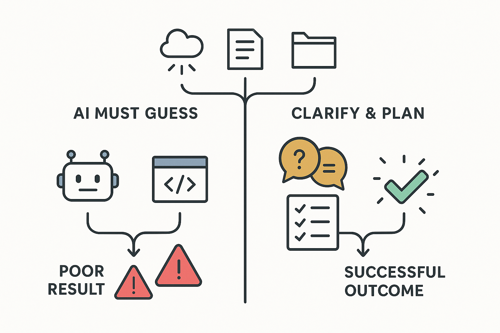

  

    <h1>Planning-First AI Methodology: The Foundation of Successful AI Collaboration</h1>
  

  

    
  

*Why starting with understanding, not code, is the key to unlocking AI's full potential in software development*

**⏱️ Reading Time**: 11 minutes

---

If you've ever watched an AI agent generate code that's technically correct but completely wrong for your situation, you've experienced the cost of skipping the planning phase. The Planning-First Methodology transforms AI from an unpredictable code generator into a reliable development partner by having it understand your problem thoroughly before writing a single line of code.

This methodology addresses the most common failure pattern in AI-assisted development: the "Hail Mary" approach where developers ask AI to generate code on the fly without proper planning. While this sometimes works for trivial tasks, it consistently fails for anything involving multiple dependencies, complex data structures, or domain-specific knowledge.

## What Is Planning-First Methodology?

Planning-First Methodology is a general approach that allows you to interact with an AI to build up understanding around a concept or idea independently of implementing the final product. Instead of immediately diving into code generation, you have the AI gather and organize thoughts at a higher level, creating a detailed implementation plan before any coding begins.

This approach provides two critical benefits:

1. **Quality Context Building**: The AI can spend time building up *good* information before it starts implementing any work
2. **Resource Optimization**: The AI doesn't need to exhaust resources on the finer details or tangential aspects required for the finished product (formatting, scripts, builds, tests, etc.) while also trying to understand the core problem

The methodology becomes especially valuable when working with tasks that span multiple dependencies and files, where it can be difficult to get all necessary information into a single prompt in a way that's useful for the AI.

## The Core Problem This Solves

The need for Planning-First Methodology arises frequently in real-world development scenarios. Consider this common situation:

You're trying to integrate additional worksheets with tables from various data structures into an existing Excel builder. You initially attempt to give the AI a general idea of the 5 data structures and the few files and methods for extending the existing workbook creator. The AI performs reasonably well, but some data is sourced from the various objects in different ways, causing confusion about how to extract similar data from differently structured objects.

This results in:
- Build errors due to incorrect dependency usage
- Some worksheets and tables generated properly, others not
- Time wasted on debugging and manual fixes
- Frustration with AI capabilities

## The Planning-First Solution

Instead of jumping straight to implementation, the Planning-First approach works like this:

### Step 1: Request an Implementation Plan
Prompt the AI to create an implementation plan without writing any code. Include:
- The files and methods you'll be working within
- The data structures you'll be using  
- An instruction to ask questions about anything needing further clarification

### Step 2: Enable Clarification Questions
This is a crucial element that transforms AI behavior. Rather than having the AI take its "best guess" at implementation details, you're asking it to take its "best guess" at whether it should gather more information. This subtle shift often makes the difference between getting the correct solution and getting completely wrong results.

Example clarifying questions the AI might ask:
- "Should I use the full list of properties or just the 'ActiveItem'?"
- "I see the Truck class has a method for 'UnlockTailgate', but the Motorcycle class does not. Should I create a method for the Motorcycle class?"
- "Should we implement this in a new class or add it to the existing class?"

### Step 3: Review and Refine the Plan
The resulting implementation plan typically includes:
- **Goal/Objective section**: Clear problem statement and intended outcome
- **Files and dependencies involved**: Specific components that will be modified
- **Data structures and their usage**: How different objects will be accessed and utilized
- **Step-by-step implementation approach**: Logical sequence of work
- **Code snippets for examples**: Concrete illustrations of key implementation points
- **Work phases with time estimates**: Organized breakdown with realistic timelines

### Step 4: Implement the Approved Plan
Once you've reviewed and refined the plan, simply instruct the AI to implement it. Because the AI has already worked through the complexity during planning, implementation typically proceeds smoothly with minimal issues.

## When to Use Planning-First Methodology

### Clear Indicators for Planning Phase

Use Planning-First when your task involves:
- **Multiple files or namespaces**
- **Complex data structure interactions**
- **Domain knowledge requirements**
- **Integration with existing systems**
- **Unclear or evolving requirements**

### Decision Framework

Planning is generally **not necessary** if you can reliably tell the agent what it needs to do with a couple of sentences that contain:
- Minimal domain knowledge
- 1 file
- 1-2 methods  
- 1-3 simple data structures

Once you grow outside these restrictions, you'll find the AI is less capable of implementing exactly what you want. Since planning phases are typically quick (seconds to minutes for simple plans), it's better to err on the side of over-planning when you're unsure.

### Time Investment Expectations

**Simple planning phases**: 15 minutes (prompt → plan generation → review)  
**Complex planning phases**: 45 minutes (multiple iterations and clarifications)

For large tasks, the percentage of time spent planning versus overall manual implementation time is dramatically less, making the investment worthwhile even for substantial projects.

## Advanced Planning Techniques

For complex projects that exceed the scope of standard planning, specialized enhancements to Planning-First Methodology provide additional power:

### Multi-Phase Planning for Enterprise Projects
When working with particularly large or complex projects, **Multi-Phase Planning** breaks the planning process into high-level architectural planning followed by detailed implementation planning. This approach is especially valuable for enterprise-scale projects requiring coordination across multiple teams and systems. For comprehensive guidance on scaling planning methodology to enterprise complexity, see **[Multi-Phase Planning: Managing Complex AI Projects with Documentation Bundles](https://bhanford9.github.io/AI-Blog-Posts/multi-phase-planning-documentation-bundles)** (16-minute read, advanced coordination techniques, essential for complex system architecture).

### Interview Method for Knowledge Extraction  
The **Interview Method** provides a specialized approach where the AI conducts a structured interview to extract scattered knowledge and organize it into comprehensive documentation. This technique excels when requirements are unclear or when extensive domain knowledge needs to be captured and structured. For detailed implementation guidance, see **[The AI Interview Method: Transform Scattered Thoughts into Professional Content](https://bhanford9.github.io/AI-Blog-Posts/ai-interview-method-scattered-thoughts)** (19-minute read, knowledge extraction workflows, ideal for complex requirement gathering).

Both techniques build on the Planning-First foundation while addressing specific challenges that arise in complex development scenarios.

## Choosing Your Planning Approach

Now that you understand the available techniques, here's how to choose the right approach for your situation:

**Use Standard Planning-First when:**
- Working on implementation projects (coding, system integration, feature development)
- Project scope fits within single AI context
- You can organize requirements and constraints yourself
- Timeline allows for straightforward planning phases

**Escalate to Multi-Phase Planning when:**
- Standard Planning-First prompt becomes 500+ words of context
- Working across 3+ major system components  
- Need preserved documentation for scaling across teams
- Enterprise-scale coordination required
- Dependencies between components are unclear or complex

**Choose Interview Method when:**
- Need comprehensive documentation or content creation
- Have scattered knowledge that requires organization
- Want AI to formalize and structure information for you
- Creating implementation plans from unclear or evolving requirements
- Prefer conversational knowledge extraction over structured prompting

**Time Investment Scaling:**
- Standard Planning-First: 15-45 minutes
- Multi-Phase Planning: 2-4 hours (enterprise projects)  
- Interview Method: 15-60 minutes (knowledge extraction)

## Common Planning Mistakes and Recovery

### Recognizing Planning Failures

Planning mistakes become evident quickly after the plan document is created:
- **Incorrect dependencies being used**
- **Planning for areas of code outside the intended scope**
- **Over-ambitious scope that exceeds reasonable prompt limits**

### Recovery Strategies

When planning goes wrong:
1. **For scope issues**: Divide your goal into smaller chunks that can be more easily planned
2. **For complexity issues**: Start planning at a higher architectural level before moving to detailed phases
3. **For major misunderstandings**: Start over with fresh context and more explicit constraints

The cost of planning failure is very low since AI planning happens quickly, making it safe to iterate until you get it right.

## Planning Success Indicators

You'll know your planning phase succeeded when you see:
- **Accurate goal description**: Opening sections that correctly describe the objective and high-level functions
- **Correct file and namespace targeting**: Implementation details that work within the intended codebase areas
- **Appropriate data structure usage**: References to the correct objects and properties
- **Logical implementation sequence**: Steps that build on each other sensibly

## Refinement and Iteration

### Common Refinements

The most frequent refinement needed is telling the AI to **remove something it included**. AI agents often appear over-confident and want to go above and beyond what was asked. This is usually a simple refinement, but it's important to make the correction so the AI remembers to omit that work during implementation.

### When to Start Over

For deeper problems than simple additions or removals, prefer starting over with enhanced planning approaches rather than extensively iterating. Extended iteration tends to lead AI agents astray, while starting fresh maintains clear context.

## Team Application and Collaboration

This methodology works excellently for pair or mob programming sessions, offering additional benefits:
- **Collective learning**: Team members learn the process together
- **Shared quality assurance**: Group review ensures higher quality plans
- **Knowledge transfer**: Planning documents serve as shared understanding

*For comprehensive strategies on introducing Planning-First Methodology to resistant team members and building organization-wide adoption, see [Overcoming AI Resistance](https://bhanford9.github.io/AI-Blog-Posts/overcoming-ai-resistance-smart-developers).*

When reviewing plans in group settings:
- **Read sections individually**: Don't rush through the document
- **Check understanding**: After each section, verify everyone understood the content
- **Address questions immediately**: Don't move forward until concerns are resolved
- **Value the learning process**: Remember that group learning about AI collaboration is part of the ROI

## Document Management and Lifecycle

### Storage and Organization

Keep planning documents in their own directory structure, independent of source code files. Littered files in source code can create visual clutter in your repository and cause AI agents to accidentally read old plans and apply outdated approaches.

### Document Lifecycle

**Recommended approach**: Prune planning documents once the intended work is complete. If you need documentation for future reference, have the AI help generate proper documentation specifically for that purpose—it will likely be much better content than an implementation plan.

## Integration with Other AI Methodologies

Planning-First Methodology serves as the foundation for more specialized AI collaboration approaches:

- **Interview Method**: Builds on planning principles by having AI conduct structured interviews to extract and organize knowledge
- **Multi-Phase Planning**: Scales planning methodology for enterprise-level projects requiring coordinated documentation bundles
- **Context Management**: Provides the planning foundation essential for working effectively in complex legacy codebases

By frontloading understanding into a dedicated planning phase, you reduce context pollution during implementation, create clear scope boundaries for AI work, and enable easier context debugging when issues arise.

## Tools and Technical Requirements

### Essential Tools

- **Markdown rendering capability**: Since AI agents typically output plans in markdown format
- **Text editor with markdown support**: For reviewing and editing plans
- **Version control**: For tracking plan iterations and maintaining document history

### Optional Enhancements

- **Template systems**: Develop standard templates for common planning scenarios
- **Checklist frameworks**: Create validation checklists for plan quality
- **Integration tools**: Connect planning documents with project management systems

## Conclusion: Planning as AI Partnership Foundation

Planning-First Methodology transforms the relationship between developers and AI from unpredictable code generation to reliable partnership. By investing a small amount of time upfront to ensure mutual understanding, you unlock AI's ability to handle complex, multi-faceted development tasks with consistency and accuracy.

The methodology scales from simple 15-minute planning sessions for straightforward tasks to enterprise-level projects using specialized enhancements like Multi-Phase Planning and the Interview Method. As you develop proficiency with planning techniques, you'll find that the time investment decreases while the quality of AI collaboration increases dramatically.

Planning-First Methodology serves as a cornerstone for organizational AI transformation, providing the systematic foundation that enables teams to move beyond ad-hoc AI usage toward competitive advantage. For comprehensive understanding of how planning methodology fits within broader AI adoption strategies and delivers measurable business value, see **[The AI Coding Revolution: Your Team's Survival Guide](https://bhanford9.github.io/AI-Blog-Posts/ai-coding-revolution-team-survival-guide)** (18-minute read, strategic adoption frameworks, essential for understanding methodology's role in organizational transformation).

The next time you're tempted to ask AI to "just generate the code," remember that a few minutes of planning can save hours of debugging and rework. Your future self—and your codebase—will thank you.

---

### **Related Posts**

**Essential Reading:**
- [The AI Coding Revolution: Team Survival Guide](https://bhanford9.github.io/AI-Blog-Posts/ai-coding-revolution-team-survival-guide) - *Build the business case and foundation for AI adoption*
- [Measuring AI Impact Beyond Gut Feeling](https://bhanford9.github.io/AI-Blog-Posts/measuring-ai-impact-beyond-gut-feeling) - *Quantify the value of systematic AI approaches*
- [AI Interview Method for Scattered Thoughts](https://bhanford9.github.io/AI-Blog-Posts/ai-interview-method-scattered-thoughts) - *Complement planning with structured problem exploration*

**Dive Deeper:**
- [Multi-Phase Planning Documentation Bundles](https://bhanford9.github.io/AI-Blog-Posts/multi-phase-planning-documentation-bundles) - *Scale planning methodology for enterprise projects*
- [Overcoming AI Resistance from Smart Developers](https://bhanford9.github.io/AI-Blog-Posts/overcoming-ai-resistance-smart-developers) - *Navigate team adoption of structured AI workflows*
